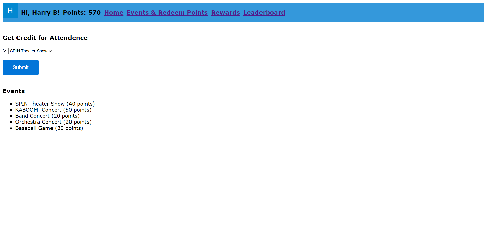
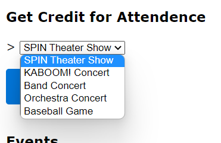

# XHS-House-App

<h1 align="center">XHS House App</h1>

Web app I'm writing for FBLA 2023 Coding and Programming

 

Developed by Harry Baldwin

Libraries used

<table>
  <tr>
    <th>Lib</th>
    <th>Purpose</th>
    <th>Link</th>
  </tr>
  <tr>
    <td>Firebase</td>
    <td>Hosting and user authentication with Google</td>
    <td>https://firebase.google.com</td>
  </tr>
  <tr>
    <td>Firestore</td>
    <td>NoSQL cloud-based database</td>
    <td>https://firebase.google.com/docs/firestore</td>
  </tr>
  <tr>
    <td>jsPDF</td>
    <td>Uses JS to generate PDF documents</td>
    <td>https://github.com/parallax/jsPDF</td>
  </tr>
</table>
 

  <h2>Logging In</h2>
  
The <a href="https://xhs-house-app.web.app">home screen</a> has a button to sign in with Google. This will be used to retreieve credentials from your Google account such as your name, email address, and profile photo. You cannot proceed unless you sign in with your Google account.
 
   
  <h3>Registering</h3>
  
To access most of the entirety of the website you must be a registered user within the school. Accounts with teacher permissions can register users at the bottom of the home page if they are logged in and have the teacher role.
 
   

  <h2>The Home Page</h2>
   
  
The home page is the center of the app. It includes the navbar to get to every accessible page on the website, information related to your account, and (special to the home navbar,) a sign-out button. There is also a tally of every houses' points from the users that belong to them. The student leaderboard on the home page shows the top 10 users ranked by their point count, but a link is under it to view the <a>full leaderboard</a>.
 
  
The color theme, (like Blue pictured above,) indicates what house you belong to, either Blue, Orange, Purple, or Red.

  
Accounts with teacher permissions will see a form to <a href="#registering">register new users</a>.

  <h2>Events & Redeem Points</h2>
   
  
The events page shows every event that you can get points for and how many points they are worth, shown in a list under the "Events" header.
 
  <h3>Redeem Points</h3>
   
  
To redeem points for an event you attended, click on the dropdown menu, select the event that you attended, and click on the "Submit" button. You should notice a change in your amount of points in your navbar right after!

